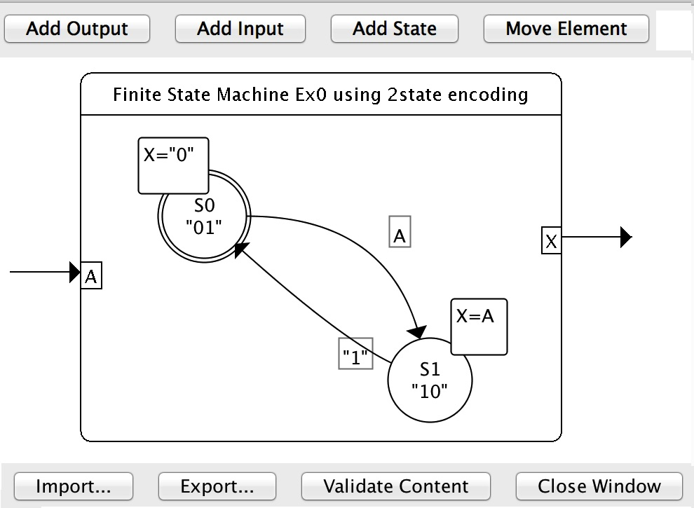

logisim-evolution with fsm library
=================
This repository is a fork from the official logisim-evolution repository (see official repository for more information) and host an early version of the tool with support for editing/analyzing and simulating Finite State Machines. 

## How to install this version of logisim-evolution
You can find an already compiled **stable** version of the code [here](http://www.irisa.fr/cosi/HOMEPAGE/Derrien/logisim/logisim-evolution.jar).

To execute it, click on the downloaded file or type in a console
```bash
java -jar logisim-evolution.jar
```

You can also compile it by yourself by cloning the repository on your local machine. Once this is done, enter the directory and execute
```bash
ant run
```
This also creates locally a .jar file, which needs to be fixed due to some library issue. To do so you must run the following command in the project folder containing the jar file.
```
zip -d logisim-evolution.jar 'META-INF/*.SF' 'META-INF/*.RSA' 'META-INF/*SF'
```

This jar can be distributed and used on other machines.

## Use the FSM editor

* Menu *project->Add Library choose internal library, there should be only a single choice (FSM library) that should be selected for loading.
* Once the library is loaded, a new entry named FSM Tools should appear on the Toolbox menu, with the Finite State Machine component available.
* You can then instanciate a FSM component in you Schematic. This FSM corresponds to a default implementation (one input A, one output X). It can be modified by clicking on the Content attribute, which will open the FSM diagram editor :

    

* The editor is in alpha stage, it allows you to add ports (click on the left/right boundaries ) , add states (click inside the main rounded rectangle) and create transitions by using drap and drop from one state to the other. It is also possible to configure every element by double clicking on it.

* Commands and predicate are specified using boolean expressions (+=OR,.=AND,/=NOT,"1"= true,"0=false) which are parsed by the editor, which also checks for satisfiable predicate (not always equals to false).      


## Editing logisim-evolution in Eclipse
To import directly logisim-evolution in Eclipse, you can use Eclipse's import wizard:

*Import -> git project -> [put the connection details] -> New project -> Java project from Ant*

You will, however, encounter a problem when you will try to execute the code. In particular, an exception *ExceptionInInitializerError* will be thrown. To solve this, execute the *eclipse_fix.sh* script in the program's directory, or go in the *bin/* subdirectory and create links to the following directories available in the program's directory
* *boards_model*
* *javax*
* *libs*
* *resources*
* *doc*

## Retro-compatibility
We cannot assure retro-compatibility of logisim-evolution with files created with the original Logisim.
We have incorporated a parser that alters the name of the components to satisfy VHDL requirements for variable names,
but components evolved in shape since then (think, for instance, to RAM and counters).
You might need to rework a bit your circuits when opening them with logisim-evolution -- but the changes will be stored
in the new format, therefore you have to do your work only once.

## Wish-list
Logisim-evolution is a continuously-growing software, and we have several ideas we would like to implement. In particular, we would like to have
* unit tests for the code
* extensive documentation
* test circuits
* ...
If you are willing to contribute with any of these, please feel free to contact us!

## How to get support for logisim-evolution
Unfortunately, we do not have enough resources to provide direct support for logisim-evolution.
We will, however, try to deal with the raised issues in a *best-effort* way.

If you find a bug or have an idea for an interesting feature, please do not hesitate to open a ticket!

## License
The code is licensed under the GNU GENERAL PUBLIC LICENSE, version 3.

## Credits
The following institutions/people actively contributed to Logisim-evolution:
* Carl Burch - Hendrix College - USA
* [Haute École Spécialisée Bernoise](http://www.bfh.ch) - Switzerland
* [Haute École du paysage, d'ingénierie et d'architecture de Genève](http://hepia.hesge.ch) - Switzerland
* [Haute École d'Ingénierie et de Gestion du Canton de Vaud](http://www.heig-vd.ch) - Switzerland
* Theldo Cruz Franqueira - Pontifícia Universidade Católica de Minas Gerais - Brasil
* Moshe Berman - Brooklyn College

If you feel that your name should be in this list, please feel free to send us a [mail](mailto:roberto.rigamonti@heig-vd.ch)!

## Other Logisim forks available on the net
* Logisim by Joseph Lawrance et al. [(link)](https://github.com/lawrancej/logisim) - they have started from Burch's original code and integrated it in several open-source development frameworks, cleaning up the code. We have taken a few code cleanups and the redo functionality from their code.
* logisim-iitd [(link)](https://code.google.com/p/logisim-iitd) - IIT Delhi version of Logisim, it integrates the Floating-Point Components within the Arithmetic Unit.
* Logisim for the CS3410 course, Cornell's University [(link)](http://www.cs.cornell.edu/courses/cs3410/2015sp/) - they have a very interesting test vector feature, that has only recently integrated in logisim-evolution.

## Alternatives
* A complete rewriting of Logisim, called Digital, has been developed by Prof. Helmut Neemann of the Baden-Württemberg Cooperative State University Mosbach. You can find it [(here)](https://github.com/hneemann/Digital).
